# React Native FinTech Clone with Clerk

This is a React Native Stocks and cryptocurrecy app made for 1% Club assignment which fullfills all the requirements given.

Additional features:
 1. Graphical representation of data.
 2. Connect your cypto wallet such as metamask.
 3. Send/recieve crypto to any wallet address.
 4. View Cryptocurrency market Data
<!-- 
- [Expo Router](https://docs.expo.dev/routing/introduction/) file-based navigation and API Routes -->

## Demo Video:
https://drive.google.com/file/d/1HQNLP7ZQuU4L3Ru5APciEFnD4QFq4Yp3/view?usp=sharing

## Deom APK:
https://drive.google.com/file/d/1YRFsY-GNrst0SZEvtFkuV-ngXFOhitSi/view?usp=sharing

## Screenshots

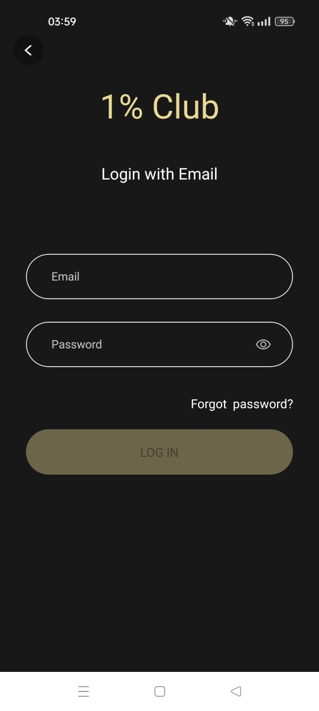

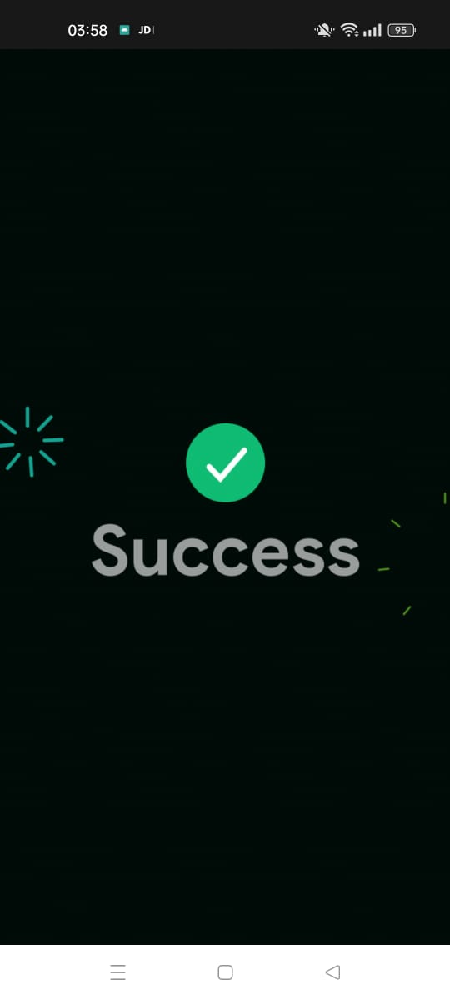
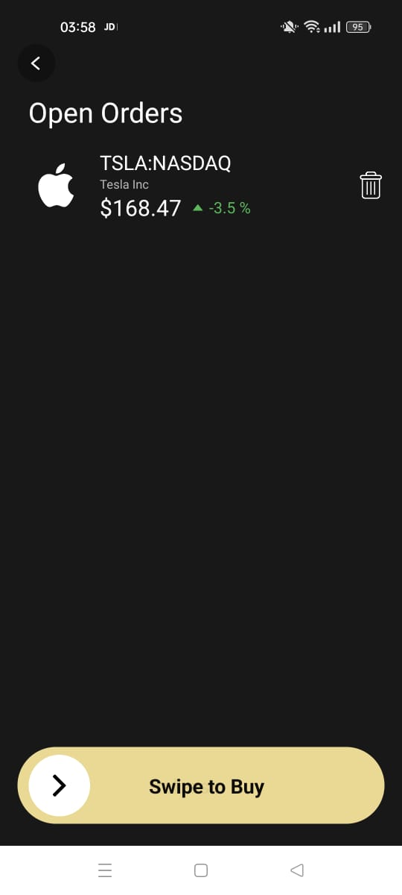
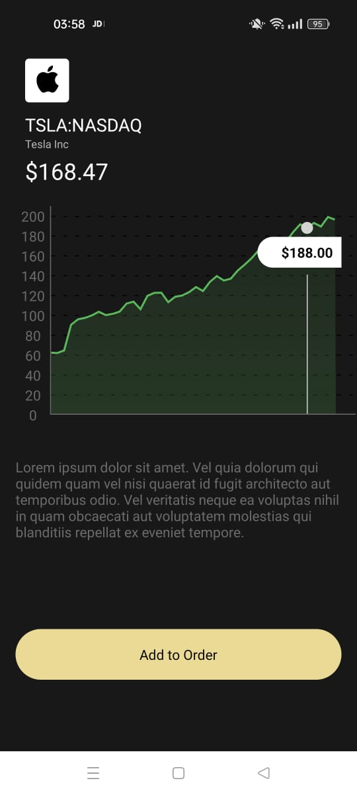
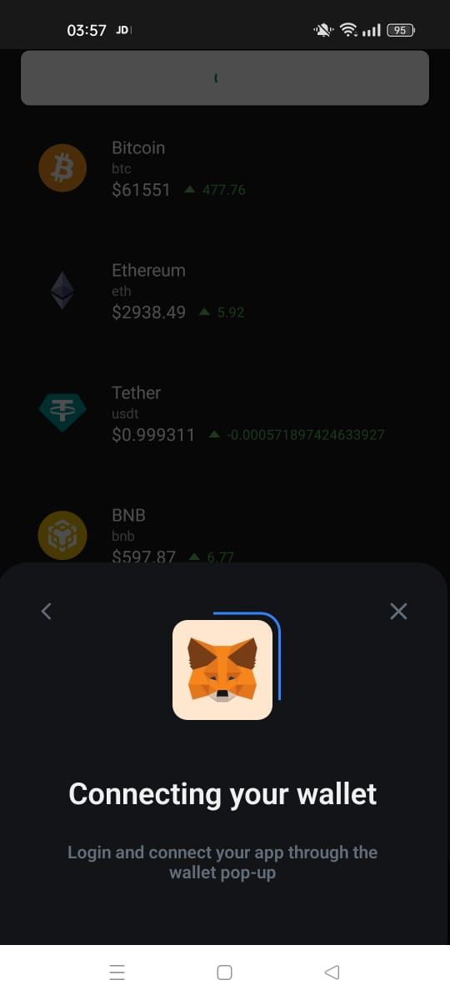
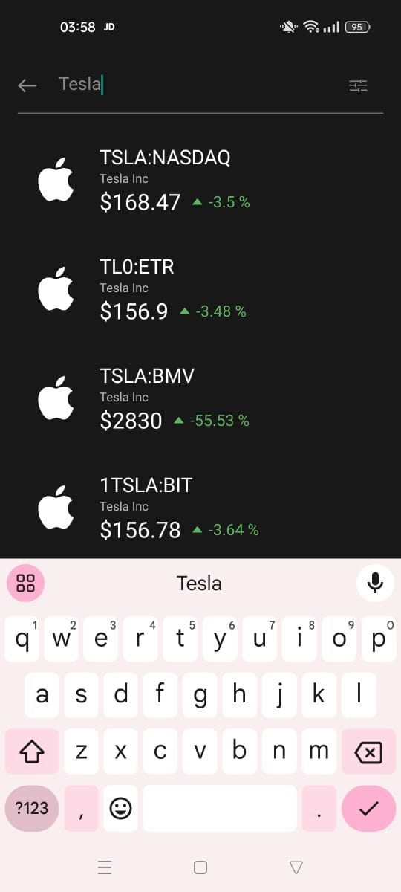
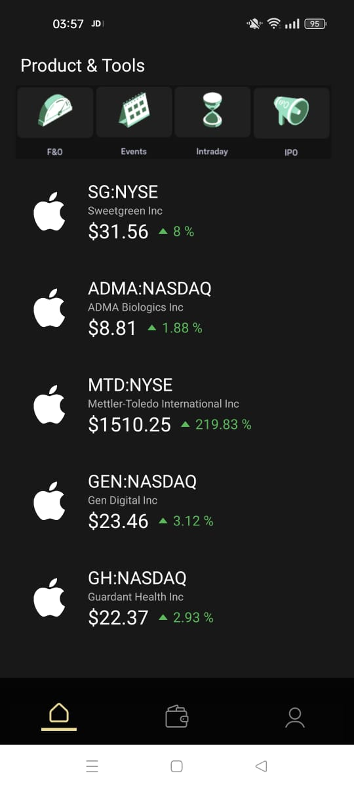
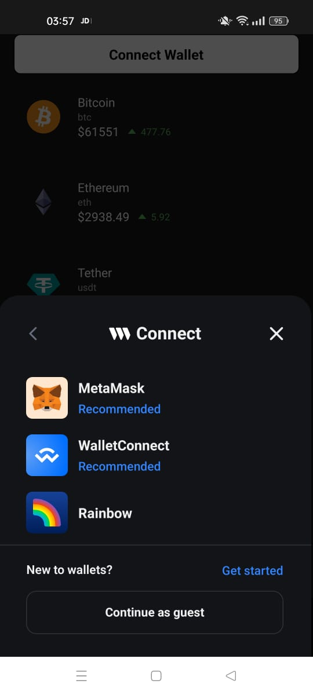
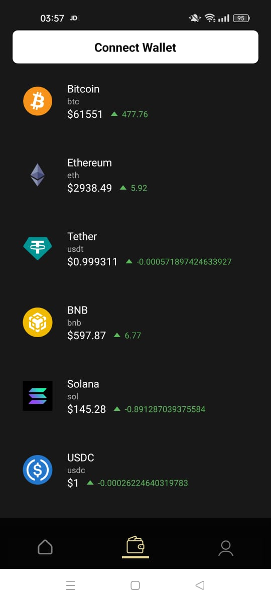
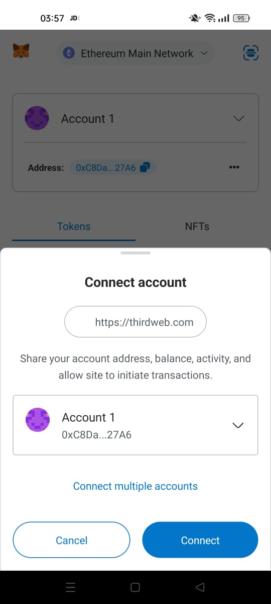
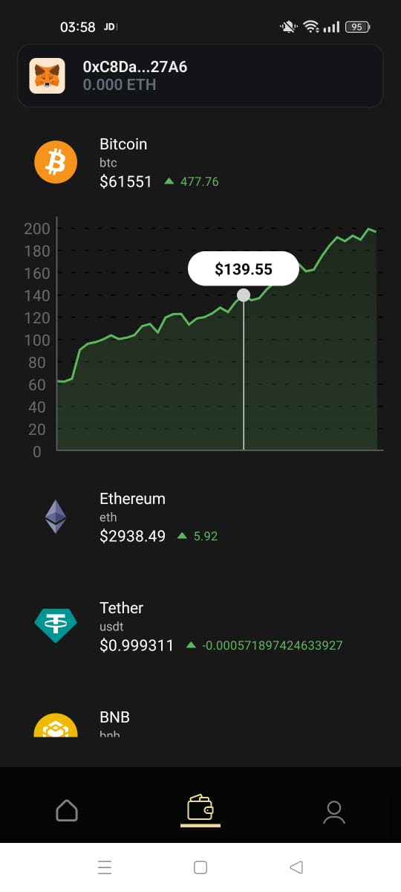
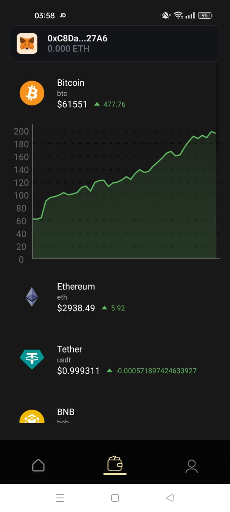

